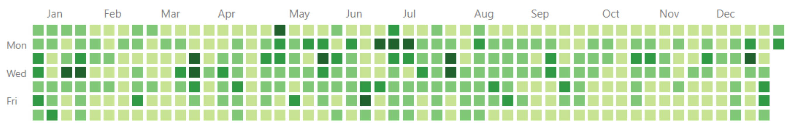

# GitHub Contribution Sync



## Overview

GitHub Contribution Sync is a tool that helps you mirror the GitHub contribution graph of another user onto your profile. It allows you to synchronize contributions for a specific year, providing a visual representation of your activity for that period.

## About

GitHub Contribution Sync is a valuable tool designed to address a common scenario faced by developers working as contractors or employees. In such situations, developers often need to create a new GitHub account distinct from their personal accounts. However, maintaining a separate GitHub profile can be challenging when you want to showcase your contributions and activities.

The primary purpose of GitHub Contribution Sync is to simplify this process. It allows developers to mirror their contributions from their personal GitHub accounts to a new, work-related account. By doing so, developers can maintain a clear separation between their personal and professional identities on GitHub while ensuring that their work and contributions are accurately reflected on their professional profiles.

This tool streamlines the sync of contributions for a specific year, making it easy for developers to maintain a professional GitHub presence that aligns with their employment or contracting responsibilities. With GitHub Contribution Sync, developers can effortlessly showcase their contributions, code activity, and commitment to their projects, enhancing their professional reputation in the software development community.

## Getting Started

To get started with GitHub Contribution Sync, follow these steps:

1. **Template Repository**: Create a new repository by using this repository as a template. Simply click [here](https://github.com/GigaMax13/github-contribution-sync/generate), provide a name for your repository, and create it.

2. **Clone Repository**: Clone your newly created repository to your local machine. Navigate to the repository directory using your terminal.

3. **Dependencies**: Ensure that Node.js and npm (or yarn) are installed on your computer. If not, you can download them from [Node.js website](https://nodejs.org/).

4. **Installation**: Install the required dependencies by running the following command in your terminal:

   ```bash
   npm install
   ```

   or

   ```bash
   yarn
   ```

5. **Start**: Initiate the sync process by running the command:

   ```bash
   npm start
   ```

   or

   ```bash
   yarn start
   ```

   Follow the terminal prompts to provide the necessary information.

6. **Update**: Once the sync is complete, you can run the following command to synchronize your new contributions:

   ```bash
   npm run update
   ```

   or

   ```bash
   yarn update
   ```

   **Note**: The `update` script will only work after a fist sync by running the `start` script.

## Configuration Options

You can customize your sync using the following configuration options:

### Start

- **Username**: Enter the GitHub username of the user whose contributions you want to mirror.
- **Year**: Specify the year you wish to synchronize. The tool currently supports sync for a single year.
- **Execution**: Choose whether to generate a `script.sh` file only or both generate and execute the script. Set to `true` for generation and execution.
- **Confirmation**: Confirm your readiness to proceed with the sync.

### Update

- **Private**: Choose whether the sync repo is private or not (the repo you created with this template). Set to `true` if the repo is private.
- **Set GitHub token**: Enter a GitHub token to authenticate the GitHub API requests. Only applicable for private sync repos.
- **Save GitHub token**: Choose whether to save the GitHub token for future use. Set to `true` to save the token.
- **Update GitHub token**: Update the GitHub token if you have already set one.
- **Execution**: Choose whether to generate a `script.sh` file only or both generate and execute the script. Set to `true` for generation and execution.
- **Confirmation**: Confirm your readiness to proceed with the sync.

## Security Assurance

The tool operates securely by design:

- **Open Source**: The entire source code is available for inspection in the [code](src/index.js) file. It's lightweight and relies on minimal dependencies.

- **Privacy**: It only accesses publicly available data from GitHub contribution graphs. It does not access private commits or issues.

- **Authentication**: It uses a GitHub token to authenticate API requests. The token is stored locally on your computer and is not shared with anyone.

## Contributions Welcome

We welcome contributions to this project. Feel free to submit pull requests to improve the tool. While there isn't a formal Contributing guide yet, this project is licensed under the [MIT](LICENSE) licensed, encouraging collaboration and improvement.

Happy synchronizing your GitHub contributions!
